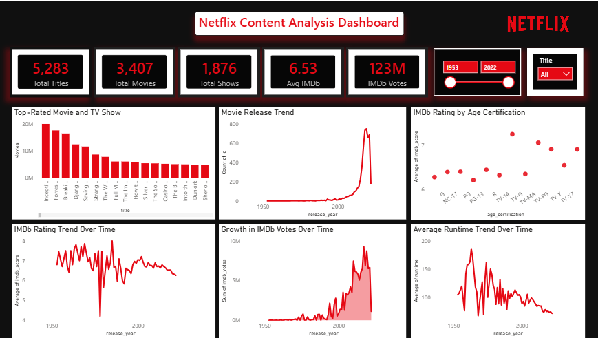

# 🎬 Netflix Content Analysis Dashboard

## 📌 Overview

This Power BI project analyzes Netflix Movies and TV Shows data to uncover trends in content performance, audience engagement, IMDb ratings, and release patterns. The dashboard provides actionable insights to support content strategy decisions.

## 🎯 Objective

* Analyze Netflix content performance using IMDb ratings and votes.
* Identify top-performing Movies and TV Shows.
* Understand content release trends over time.
* Evaluate audience engagement and rating patterns.
* Generate business recommendations through data visualization.

## 💼 Business Problem

Netflix needs to understand:

* Which content performs best?
* How content production has evolved over time.
* Whether audience engagement is increasing.
* Which content categories receive the highest ratings.

## 🛠 Tools Used

* Power BI
* Power Query
* Microsoft Excel

## 📊 Dashboard Preview

## 📈 Key KPIs

| KPI             | Value |
| --------------- | ----- |
| Total Titles    | 5,283 |
| Movies          | 3,407 |
| TV Shows        | 1,876 |
| Avg IMDb Rating | 6.53  |
| IMDb Votes      | 123M  |

## 🧹 Data Cleaning

* Removed unnecessary columns (`index`, `imdb_id`)
* Handled missing IMDb votes
* Created custom metric: **IMDb Score × IMDb Votes**
* Validated data quality and data types

## 🔍 Analysis Performed

1. Top-Rated Movies & TV Shows
2. Movie Release Trend
3. IMDb Rating Trend
4. IMDb Votes Trend
5. Runtime Trend
6. Age Certification Analysis

## 💡 Key Insights

* Movies represent **64.5%** of the catalog.
* Content releases increased significantly after 2010.
* Top-performing titles include **Inception, Forrest Gump, and Breaking Bad**.
* Average IMDb Rating remained stable at **6.53**.
* Audience engagement increased in recent years.
* TV-14 emerged as the highest-rated certification category.
* Average runtime gradually decreased over time.

## 🚀 Business Recommendations

* Invest more in high-performing TV-14 content.
* Prioritize highly-rated TV Shows.
* Use Rating × Votes to evaluate content success.
* Explore shorter content formats based on viewer preferences.

## 📂 Files Included

* Netflix_Content_Analysis.pbix
* Netflix_Content_Dataset.xlsx
* Dashboard.png

## 👨‍💻 Author

**Rahul Chhabra**
